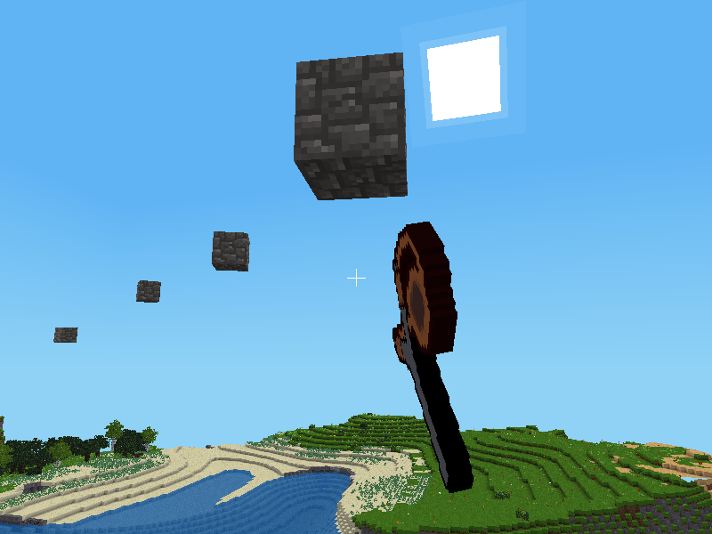

# Slingshot Mod for Minetest

---
### **Description:**

Adds a slingshot that can throw inventory items as ammunition.

The original code was extracted from [hook][] mod by [AiTechEye][].

Depends:
- default

Optional depends (soft):
- technic

---
### **Licensing:**

- Code
  - Original code by AiTechEye: [CC0][lic.cc0]
  - Code by Jordan Irwin (AntumDeluge): [MIT][lic.mit]

- Textures:
  - slingshots: [CC0][lic.cc0]
  - rubber band: [CC0][lic.cc0]

---
### **Usage:**

- *Left-click*: Throws items from slot right of slingshot.

---
### **Crafting:**

##### Legend:

* `SI` = default:steel_ingot
* `ST` = default:stick
* `RB` = slingshot:rubber_band
* `TR` = technic:rubber
* `TL` = technic:raw_latex

##### Recipes:

wooden slingshot:

    ╔════╦════╦════╗
    ║ ST ║    ║ ST ║
    ╠════╬════╬════╣
    ║    ║ ST ║    ║
    ╠════╬════╬════╣
    ║    ║ ST ║    ║
    ╚════╩════╩════╝

wooden slingshot (rubber band required with technic):

    ╔════╦════╦════╗
    ║ ST ║ RB ║ ST ║
    ╠════╬════╬════╣
    ║    ║ ST ║    ║
    ╠════╬════╬════╣
    ║    ║ ST ║    ║
    ╚════╩════╩════╝

iron slingshot:

    ╔════╦════╦════╗
    ║ SI ║    ║ SI ║
    ╠════╬════╬════╣
    ║    ║ SI ║    ║
    ╠════╬════╬════╣
    ║    ║ SI ║    ║
    ╚════╩════╩════╝

iron slingshot (rubber band required with technic):

    ╔════╦════╦════╗
    ║ SI ║ RB ║ SI ║
    ╠════╬════╬════╣
    ║    ║ SI ║    ║
    ╠════╬════╬════╣
    ║    ║ SI ║    ║
    ╚════╩════╩════╝

rubber band:

    ╔════╦════╦════╗
    ║ TL ║ TL ║    ║
    ╠════╬════╬════╣
    ║ TL ║    ║ TL ║
    ╠════╬════╬════╣
    ║    ║ TL ║ TL ║
    ╚════╩════╩════╝

rubber band (shapeless):

    ╔════╗
    ║ TR ║
    ╚════╝

---
### **Links:**

- [HTML Reference](https://antummt.github.io/mod-slingshot/reference)
- [Changelog](changelog.txt)
- [TODO](TODO.txt)

[AiTechEye]: https://forum.minetest.net/memberlist.php?mode=viewprofile&u=16172

[hook]: https://forum.minetest.net/viewtopic.php?t=13634

[lic.cc0]: LICENSE-cc0.txt
[lic.mit]: LICENSE.txt
